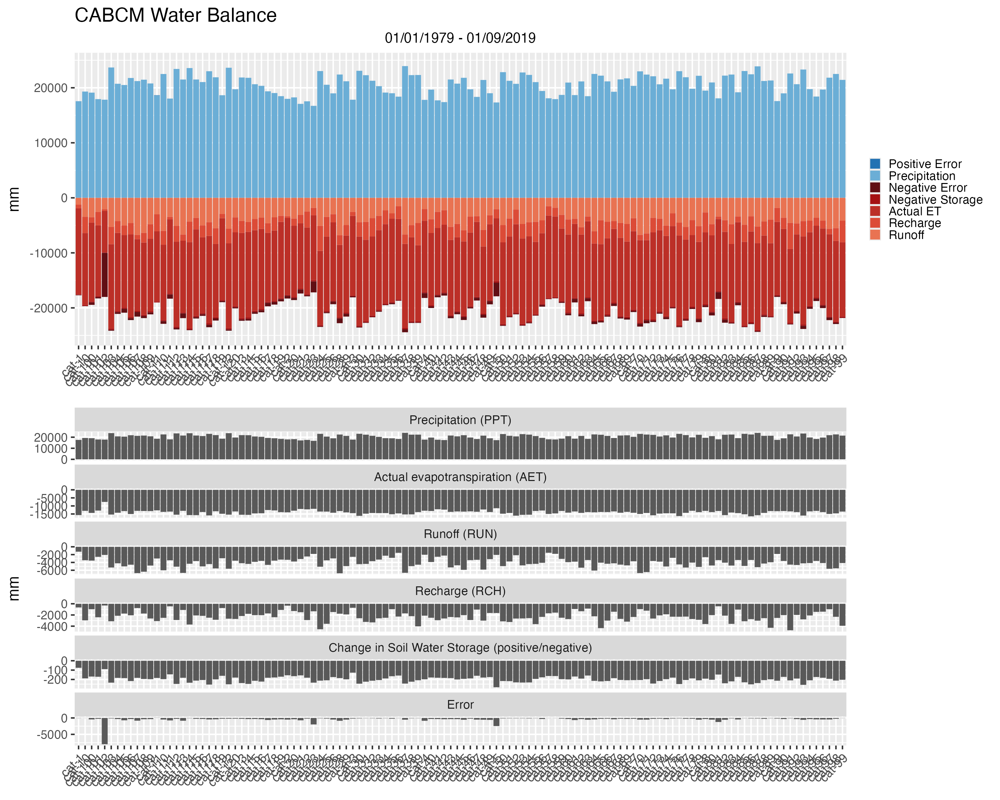
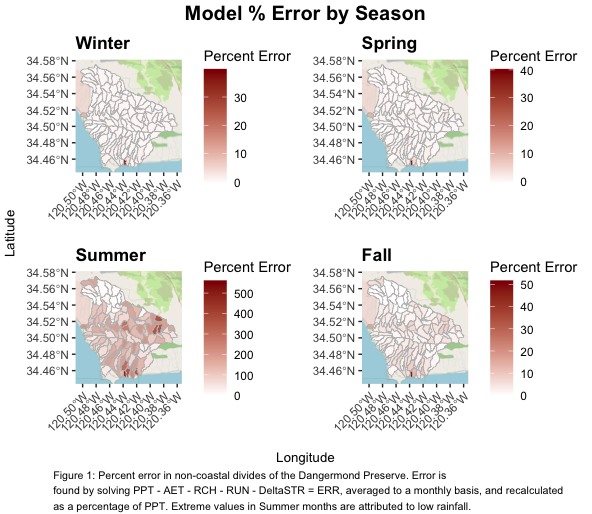
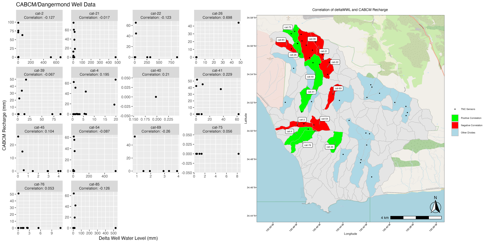
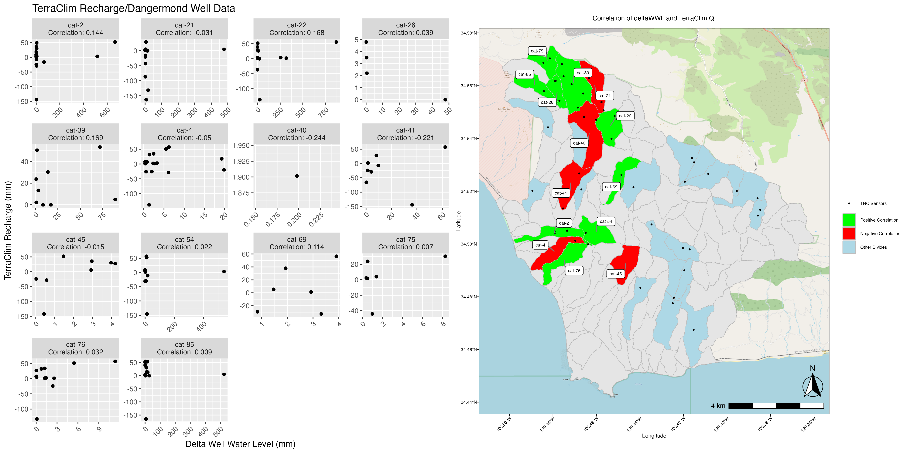

The Nature Conservancy has partnered with Lynker to develop a digital twin of the Jack and Laura Dangermond Preserve, at Point Conception in California, and pioneer the adoption of the Next Generation Water Resources Modeling Framework (NextGen).

In the summer of 2024 I joined <a href="https://lynker.com/" target="_blank">Lynker</a> as an Intern and contributed to this project by creating adaptable pipelines for sensor data, historic water balances based on current leading models, and by being among the first to work with the NextGen Model. 

I developed an R Package, <a href="https://lynker-spatial.github.io/WaterBalanceSummary/index.html" target="_blank">WaterBalanceSummary</a> that can be used to streamline this analysis. Sample datasets to allow reproduction of work are pending.

There is a network of gauges throughout the watershed which provide historic data from 2010 to present. Leveraging this real world data against model projections allows us to train a NextGen Model to predict future outcomes for the watershed with the end goal of developing a tool to be deployed by the State of California.

Pulling data from the <a href="https://ca.water.usgs.gov/projects/reg_hydro/basin-characterization-model.html" target="_blank">California Basin Characterization Model (CABCM)</a> and <a href="https://www.climatologylab.org/terraclimate.html" target="_blank">Terra Climate (TerraClim)</a> allowed me to develop a water balance for the watershed and to visualize the inputs and outputs to the system.

### Water Balances
<!-- CABCM Water Balance -->

<!-- Terra Water Balance -->

<!--  -->
<!-- CABCM Corr Plot -->

Using this data also allows a visualization of error, where inputs and outputs to the system do not perfectly align. Calculated as PPT - AET - RCH - RUN - DeltaSTR = ERR

### SeasonalError

Comparing delta well water level and change in soil moisture data allows a visualization of the accuracy of current models recharge data to real world conditions. The plots below show a lack of positive correlation between the two, indicating low model accuracy in the Jalama Creek Watershed.

<!-- Terra Corr Plot -->

